# SpringAI-MCP 核心流程详解

## 1. Text2SQL 核心转换流程

### 1.1 完整处理流程


### 1.2 数据库结构发现详细流程


### 1.3 SQL安全验证流程


## 2. 缓存系统流程

### 2.1 多级缓存架构

```mermaid
graph TB
    subgraph "应用层"
        Service[Text2SqlService]
    end
    
    subgraph "缓存层"
        SchemaCache[SchemaCache Service]
        
        subgraph "本地缓存"
            LocalMap[ConcurrentHashMap]
            TTL[TTL管理机制]
            LocalMap --> TTL
        end
        
        subgraph "Spring缓存抽象"
            CacheManager[CacheManager]
            CacheAnn[@Cacheable注解]
            CacheManager --> CacheAnn
        end
        
        subgraph "分布式缓存 (可选)"
            Redis[(Redis)]
            RedisTemplate[RedisTemplate]
            Redis --> RedisTemplate
        end
    end
    
    subgraph "数据源"
        Database[(MySQL)]
    end
    
    Service --> SchemaCache
    SchemaCache --> LocalMap
    SchemaCache --> CacheManager
    CacheManager -.-> RedisTemplate
    SchemaCache --> Database
    
    style LocalMap fill:#90EE90
    style Redis fill:#87CEEB,stroke-dasharray: 5 5
```

### 2.2 缓存更新策略

```mermaid
stateDiagram-v2
    [*] --> CacheEmpty : 首次访问
    CacheEmpty --> LoadingFromDB : 开始加载数据库结构
    LoadingFromDB --> CacheFresh : 加载完成，缓存新鲜
    
    CacheFresh --> CacheValid : 访问时检查TTL
    CacheValid --> CacheFresh : TTL未过期
    CacheValid --> CacheExpired : TTL已过期
    
    CacheExpired --> LoadingFromDB : 重新加载
    
    CacheFresh --> CacheInvalidated : 手动清除缓存
    CacheInvalidated --> CacheEmpty : 缓存已清空
    
    note right of CacheFresh : TTL: 3600秒<br/>自动过期策略
    note right of LoadingFromDB : 数据库结构发现<br/>大约需要5-7秒
```

## 3. MCP 集成流程

### 3.1 MCP 服务架构


### 3.2 结构化并发执行流程


## 4. 前端交互流程

### 4.1 用户界面交互流程

```mermaid
stateDiagram-v2
    [*] --> PageLoad : 页面加载
    PageLoad --> CheckConnection : 检查数据库连接
    CheckConnection --> LoadSchema : 连接成功，加载数据库结构
    LoadSchema --> ReadyForQuery : 准备接收查询
    
    ReadyForQuery --> QueryInput : 用户输入查询
    QueryInput --> Validating : 前端验证输入
    Validating --> SendingRequest : 发送API请求
    
    SendingRequest --> ProcessingQuery : 后端处理中
    ProcessingQuery --> ShowResults : 显示结果
    ProcessingQuery --> ShowError : 显示错误信息
    
    ShowResults --> ReadyForQuery : 准备下一次查询
    ShowError --> ReadyForQuery : 修正后重新查询
    
    ReadyForQuery --> ExecuteSQL : 直接执行SQL
    ExecuteSQL --> ShowQueryResults : 显示查询结果
    ShowQueryResults --> ReadyForQuery
    
    note right of ProcessingQuery : 显示加载状态<br/>约10-15秒处理时间
    note right of LoadSchema : 显示数据库表结构<br/>支持折叠展开
```



### 4.2 前端状态管理


## 5. 学习系统流程

### 5.1 泛化学习机制


### 5.2 模式学习生命周期


## 6. 错误处理和恢复流程

### 6.1 异常处理层次


### 6.2 服务降级策略


---

*最后更新: 2025-09-11*