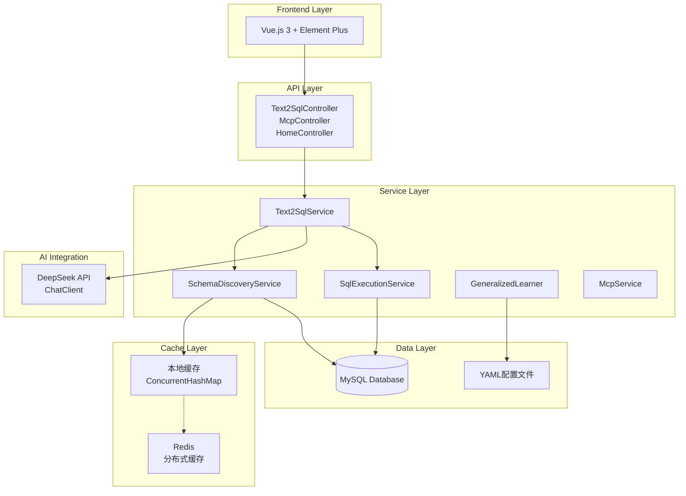
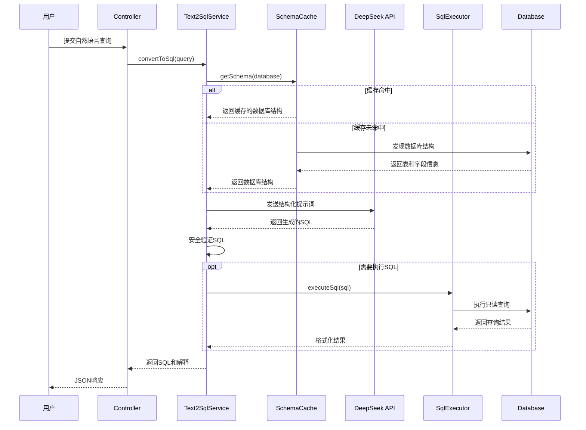
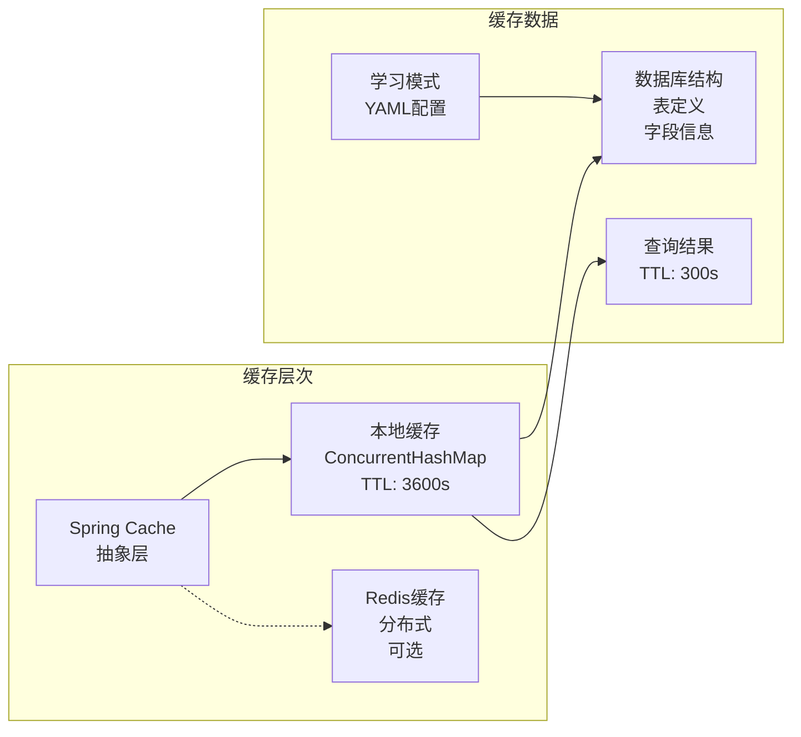
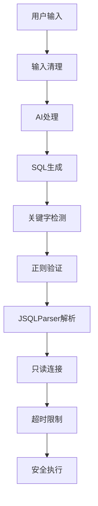

# SpringAI-MCP 项目架构总览

## 项目简介

SpringAI-MCP 是一个基于 Spring Boot 3.4.1 和 Java 24 的智能数据库查询平台，实现了自然语言到 SQL 语句的转换功能。项目集成了多种先进技术，包括 Spring AI、DeepSeek API、虚拟线程、结构化并发等。

## 核心特性

### 🧠 智能 SQL 生成
- 基于 DeepSeek API 的自然语言处理
- 智能数据库结构分析
- 上下文感知的 SQL 生成
- 多重安全验证机制

### 🚀 高性能架构
- Java 24 虚拟线程支持
- 结构化并发处理
- 智能缓存系统 (本地缓存 + Redis 支持)
- HikariCP 数据库连接池

### 🔒 企业级安全
- 多层 SQL 注入防护
- 只读数据库连接
- 危险关键字检测
- 查询超时和大小限制

### 🎯 学习能力
- 基于用户反馈的模式学习
- 语义分析和意图识别
- 跨数据库泛化能力
- YAML 配置的学习数据

## 技术架构

### 系统架构图

### 模块划分

#### 📊 Text2SQL 模块 (核心业务)
- **职责**: 自然语言转 SQL 的核心逻辑
- **主要组件**:
  - `Text2SqlService`: 核心转换服务
  - `SchemaDiscoveryService`: 数据库结构发现
  - `SqlExecutionService`: 安全 SQL 执行
  - `GeneralizedLearner`: 机器学习组件
  - `SemanticAnalyzer`: 语义分析器

#### 🔌 MCP 模块 (协议集成)
- **职责**: Model Context Protocol 集成
- **主要组件**:
  - `McpService`: MCP 操作服务
  - `McpController`: MCP API 端点
  - 支持文件系统和 GitHub 集成

#### 🛠️ Common 模块 (共享组件)
- **职责**: 通用工具和配置
- **主要组件**:
  - `SchemaCache`: 缓存服务
  - `CacheConfig`: 缓存配置

## 数据流程

### Text2SQL 转换流程

### 缓存机制

## 性能特征

### 当前性能指标
- **首次查询**: ~14s (包含数据库结构发现和AI处理)
- **缓存命中查询**: ~13s (使用缓存的数据库结构)
- **数据库连接池**: 5-20 连接
- **内存使用**: 适中 (主要用于缓存和AI上下文)

### 性能瓶颈分析
1. **AI API 延迟**: DeepSeek API 调用占用大部分时间
2. **数据库结构发现**: 首次访问需要完整扫描
3. **SQL 解析验证**: JSQLParser 处理开销

## 安全机制

### 多层安全防护

### 安全特性
- **SQL注入防护**: 多重验证机制
- **只读模式**: 数据库连接限制
- **查询限制**: 超时和结果集大小控制
- **关键字黑名单**: 危险操作检测

## 扩展性设计

### 水平扩展能力
- 无状态架构设计
- Redis 分布式缓存支持
- 数据库连接池可配置
- 负载均衡友好

### 垂直扩展能力
- JVM 参数可调优
- 缓存大小可配置
- 连接池参数可调节
- AI API 并发控制

## 监控和运维

### 内置监控
- Spring Boot Actuator
- 自定义健康检查
- 执行时间跟踪
- 错误统计和分析

### 日志策略
- 结构化日志输出
- 性能指标记录
- 错误上下文保留
- 调试信息分级

## 技术栈总结

| 层级 | 技术选型 | 版本 | 用途 |
|------|----------|------|------|
| 应用框架 | Spring Boot | 3.4.1 | 核心框架 |
| AI集成 | Spring AI | 1.0.0-M5 | AI能力 |
| 数据库 | MySQL | 8.0+ | 数据存储 |
| 连接池 | HikariCP | 内置 | 连接管理 |
| 缓存 | 本地缓存+Redis | - | 性能优化 |
| 前端 | Vue.js 3 | 3.x | 用户界面 |
| UI组件 | Element Plus | - | UI框架 |
| 并发 | Virtual Threads | Java 24 | 高并发处理 |

## 下一步优化方向

### 短期优化 (1-2周)
1. **AI API 优化**: 实现请求批处理和本地缓存
2. **数据库查询优化**: 增量结构发现
3. **前端性能**: 虚拟滚动和懒加载
4. **监控增强**: 添加 Micrometer 指标

### 中期优化 (1-2月)
1. **多数据库支持**: PostgreSQL、SQLite 扩展
2. **分布式缓存**: Redis 完整集成
3. **API 限流**: 生产环境保护机制
4. **测试覆盖**: 单元和集成测试

### 长期规划 (3-6月)
1. **微服务架构**: 模块独立部署
2. **容器化**: Docker 和 Kubernetes 支持
3. **AI 模型优化**: 本地模型部署考虑
4. **企业功能**: 权限管理、审计日志

---

*最后更新: 2025-09-11*