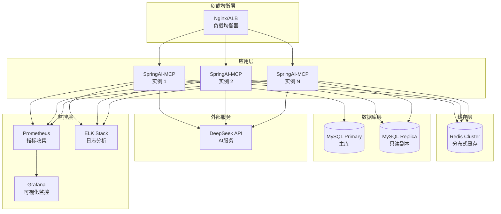

# SpringAI-MCP 生产环境部署指南

## 部署架构概览

### 推荐生产环境架构



## 环境配置

### 1. 生产环境配置文件

**application-prod.yml**:
```yaml
# 服务器配置
server:
  port: 8080
  servlet:
    context-path: /
  tomcat:
    max-connections: 1000
    threads:
      max: 200
      min-spare: 20
    connection-timeout: 20s

# Spring 配置
spring:
  profiles:
    active: prod
  
  # 数据源配置 - 主库
  datasource:
    primary:
      url: jdbc:mysql://mysql-primary:3306/text2sql_prod?useUnicode=true&characterEncoding=utf8&useSSL=true&serverTimezone=UTC
      username: ${DB_USERNAME}
      password: ${DB_PASSWORD}
      driver-class-name: com.mysql.cj.jdbc.Driver
      hikari:
        pool-name: Text2SQL-Primary-HikariCP
        minimum-idle: 10
        maximum-pool-size: 50
        idle-timeout: 600000
        max-lifetime: 1800000
        connection-timeout: 30000
        validation-timeout: 5000
        leak-detection-threshold: 60000
    
    # 只读副本
    replica:
      url: jdbc:mysql://mysql-replica:3306/text2sql_prod?useUnicode=true&characterEncoding=utf8&useSSL=true&serverTimezone=UTC
      username: ${DB_REPLICA_USERNAME}
      password: ${DB_REPLICA_PASSWORD}
      driver-class-name: com.mysql.cj.jdbc.Driver
      hikari:
        pool-name: Text2SQL-Replica-HikariCP
        minimum-idle: 5
        maximum-pool-size: 30
        idle-timeout: 600000
        max-lifetime: 1800000
        connection-timeout: 30000
        validation-timeout: 5000
        read-only: true
  
  # Redis 配置
  data:
    redis:
      cluster:
        nodes:
          - redis-cluster-1:6379
          - redis-cluster-2:6379
          - redis-cluster-3:6379
        max-redirects: 3
      timeout: 5000ms
      jedis:
        pool:
          max-active: 100
          max-idle: 20
          min-idle: 5
          max-wait: 2000ms

# AI 服务配置
spring:
  ai:
    openai:
      api-key: ${DEEPSEEK_API_KEY}
      base-url: https://api.deepseek.com
      chat:
        options:
          model: deepseek-chat
          temperature: 0.1
          max-tokens: 1000
        
# 应用特定配置
text2sql:
  cache:
    enabled: true
    schema-ttl: 7200  # 2小时
    query-ttl: 600    # 10分钟
    ai-response-ttl: 3600  # 1小时
  
  security:
    sql-validation:
      enabled: true
      max-sql-length: 5000
      query-timeout: 45s
      max-result-rows: 5000
    
    rate-limiting:
      enabled: true
      requests-per-minute: 30
      requests-per-hour: 500
  
  ai:
    request-timeout: 30s
    max-retries: 3
    circuit-breaker:
      enabled: true
      failure-threshold: 5
      recovery-timeout: 60s

# 日志配置
logging:
  level:
    com.kami.springai: INFO
    org.springframework.cache: DEBUG
    org.springframework.ai: INFO
    com.zaxxer.hikari: INFO
  pattern:
    console: "%d{yyyy-MM-dd HH:mm:ss.SSS} [%thread] %-5level [%X{traceId}] %logger{36} - %msg%n"
    file: "%d{yyyy-MM-dd HH:mm:ss.SSS} [%thread] %-5level [%X{traceId}] %logger{36} - %msg%n"
  file:
    name: /var/log/springai-mcp/application.log
    max-size: 100MB
    max-history: 30
    total-size-cap: 10GB

# 监控配置
management:
  endpoints:
    web:
      exposure:
        include: health,info,metrics,prometheus,env
      base-path: /actuator
  endpoint:
    health:
      show-details: when_authorized
      show-components: always
  metrics:
    export:
      prometheus:
        enabled: true
        step: 30s
```

### 2. 环境变量配置

**.env.prod**:
```bash
# 数据库配置
DB_USERNAME=text2sql_prod_user
DB_PASSWORD=your_secure_primary_password
DB_REPLICA_USERNAME=text2sql_replica_user  
DB_REPLICA_PASSWORD=your_secure_replica_password

# AI API 配置
DEEPSEEK_API_KEY=your_deepseek_api_key

# Redis 配置  
REDIS_PASSWORD=your_redis_cluster_password

# 监控配置
PROMETHEUS_ENABLED=true
GRAFANA_ADMIN_PASSWORD=your_grafana_password

# JVM 配置
JAVA_OPTS=-Xms2g -Xmx4g -XX:+UseG1GC -XX:G1HeapRegionSize=16m -XX:+UseStringDeduplication
```

## Docker 部署

### 1. Dockerfile

```dockerfile
# 多阶段构建
FROM openjdk:24-ea-17-jdk-slim AS builder

WORKDIR /app
COPY . .
RUN ./gradlew clean build -x test --no-daemon

FROM openjdk:24-ea-17-jre-slim

# 安装必要工具
RUN apt-get update && apt-get install -y \
    curl \
    netcat-openbsd \
    && rm -rf /var/lib/apt/lists/*

# 创建用户
RUN groupadd -r springai && useradd -r -g springai springai

# 创建目录
RUN mkdir -p /app/logs /app/config
WORKDIR /app

# 复制应用文件
COPY --from=builder /app/build/libs/*.jar app.jar
COPY --from=builder /app/src/main/resources/config/ config/

# 设置权限
RUN chown -R springai:springai /app
USER springai

# 健康检查
HEALTHCHECK --interval=30s --timeout=10s --start-period=60s --retries=3 \
  CMD curl -f http://localhost:8080/actuator/health || exit 1

# 暴露端口
EXPOSE 8080

# 启动命令
ENTRYPOINT ["java", "-jar", "app.jar"]
CMD ["--spring.profiles.active=prod"]
```

### 2. Docker Compose

**docker-compose.prod.yml**:
```yaml
version: '3.8'

services:
  springai-mcp:
    build: .
    ports:
      - "8080:8080"
    environment:
      - SPRING_PROFILES_ACTIVE=prod
      - DB_USERNAME=${DB_USERNAME}
      - DB_PASSWORD=${DB_PASSWORD}
      - DEEPSEEK_API_KEY=${DEEPSEEK_API_KEY}
    volumes:
      - ./logs:/app/logs
      - ./config:/app/config
    depends_on:
      - mysql-primary
      - redis-cluster
    deploy:
      replicas: 3
      resources:
        limits:
          memory: 4G
          cpus: '2'
        reservations:
          memory: 2G
          cpus: '1'
    healthcheck:
      test: ["CMD", "curl", "-f", "http://localhost:8080/actuator/health"]
      interval: 30s
      timeout: 10s
      retries: 3
      start_period: 60s

  mysql-primary:
    image: mysql:8.0
    environment:
      MYSQL_ROOT_PASSWORD: ${MYSQL_ROOT_PASSWORD}
      MYSQL_DATABASE: text2sql_prod
      MYSQL_USER: ${DB_USERNAME}
      MYSQL_PASSWORD: ${DB_PASSWORD}
    volumes:
      - mysql_primary_data:/var/lib/mysql
      - ./mysql/conf.d:/etc/mysql/conf.d
    ports:
      - "3306:3306"
    command: --default-authentication-plugin=mysql_native_password
    
  mysql-replica:
    image: mysql:8.0
    environment:
      MYSQL_ROOT_PASSWORD: ${MYSQL_ROOT_PASSWORD}
      MYSQL_DATABASE: text2sql_prod
    volumes:
      - mysql_replica_data:/var/lib/mysql
      - ./mysql/replica.cnf:/etc/mysql/conf.d/replica.cnf
    ports:
      - "3307:3306"
    depends_on:
      - mysql-primary

  redis-cluster:
    image: redis:7.0-alpine
    ports:
      - "6379:6379"
    volumes:
      - redis_data:/data
      - ./redis/redis.conf:/usr/local/etc/redis/redis.conf
    command: redis-server /usr/local/etc/redis/redis.conf

  nginx:
    image: nginx:alpine
    ports:
      - "80:80"
      - "443:443"
    volumes:
      - ./nginx/nginx.conf:/etc/nginx/nginx.conf
      - ./nginx/ssl:/etc/nginx/ssl
    depends_on:
      - springai-mcp

  prometheus:
    image: prom/prometheus
    ports:
      - "9090:9090"
    volumes:
      - ./monitoring/prometheus.yml:/etc/prometheus/prometheus.yml
      - prometheus_data:/prometheus
    command:
      - '--config.file=/etc/prometheus/prometheus.yml'
      - '--storage.tsdb.path=/prometheus'
      - '--web.console.libraries=/etc/prometheus/console_libraries'
      - '--web.console.templates=/etc/prometheus/consoles'

  grafana:
    image: grafana/grafana
    ports:
      - "3000:3000"
    environment:
      - GF_SECURITY_ADMIN_PASSWORD=${GRAFANA_ADMIN_PASSWORD}
    volumes:
      - grafana_data:/var/lib/grafana
      - ./monitoring/grafana/dashboards:/etc/grafana/provisioning/dashboards
      - ./monitoring/grafana/datasources:/etc/grafana/provisioning/datasources

volumes:
  mysql_primary_data:
  mysql_replica_data:
  redis_data:
  prometheus_data:
  grafana_data:

networks:
  default:
    driver: bridge
```

## Kubernetes 部署

### 1. 应用部署配置

**k8s/deployment.yaml**:
```yaml
apiVersion: apps/v1
kind: Deployment
metadata:
  name: springai-mcp
  namespace: text2sql-prod
spec:
  replicas: 3
  selector:
    matchLabels:
      app: springai-mcp
  template:
    metadata:
      labels:
        app: springai-mcp
    spec:
      containers:
      - name: springai-mcp
        image: springai-mcp:latest
        ports:
        - containerPort: 8080
          name: http
        env:
        - name: SPRING_PROFILES_ACTIVE
          value: "prod"
        - name: DB_USERNAME
          valueFrom:
            secretKeyRef:
              name: database-secret
              key: username
        - name: DB_PASSWORD
          valueFrom:
            secretKeyRef:
              name: database-secret
              key: password
        - name: DEEPSEEK_API_KEY
          valueFrom:
            secretKeyRef:
              name: ai-service-secret
              key: api-key
        resources:
          requests:
            memory: "2Gi"
            cpu: "1000m"
          limits:
            memory: "4Gi"
            cpu: "2000m"
        livenessProbe:
          httpGet:
            path: /actuator/health
            port: 8080
          initialDelaySeconds: 60
          periodSeconds: 30
          timeoutSeconds: 10
          failureThreshold: 3
        readinessProbe:
          httpGet:
            path: /actuator/health/readiness
            port: 8080
          initialDelaySeconds: 30
          periodSeconds: 10
          timeoutSeconds: 5
          failureThreshold: 3
        volumeMounts:
        - name: config-volume
          mountPath: /app/config
        - name: logs-volume
          mountPath: /app/logs
      volumes:
      - name: config-volume
        configMap:
          name: springai-config
      - name: logs-volume
        emptyDir: {}

---
apiVersion: v1
kind: Service
metadata:
  name: springai-mcp-service
  namespace: text2sql-prod
spec:
  selector:
    app: springai-mcp
  ports:
  - port: 80
    targetPort: 8080
    protocol: TCP
  type: ClusterIP

---
apiVersion: networking.k8s.io/v1
kind: Ingress
metadata:
  name: springai-mcp-ingress
  namespace: text2sql-prod
  annotations:
    kubernetes.io/ingress.class: "nginx"
    cert-manager.io/cluster-issuer: "letsencrypt-prod"
    nginx.ingress.kubernetes.io/rate-limit: "30"
    nginx.ingress.kubernetes.io/rate-limit-window: "1m"
spec:
  tls:
  - hosts:
    - text2sql.yourdomain.com
    secretName: text2sql-tls
  rules:
  - host: text2sql.yourdomain.com
    http:
      paths:
      - path: /
        pathType: Prefix
        backend:
          service:
            name: springai-mcp-service
            port:
              number: 80
```

### 2. HPA (水平扩展)

**k8s/hpa.yaml**:
```yaml
apiVersion: autoscaling/v2
kind: HorizontalPodAutoscaler
metadata:
  name: springai-mcp-hpa
  namespace: text2sql-prod
spec:
  scaleTargetRef:
    apiVersion: apps/v1
    kind: Deployment
    name: springai-mcp
  minReplicas: 3
  maxReplicas: 10
  metrics:
  - type: Resource
    resource:
      name: cpu
      target:
        type: Utilization
        averageUtilization: 70
  - type: Resource
    resource:
      name: memory
      target:
        type: Utilization
        averageUtilization: 80
  behavior:
    scaleUp:
      stabilizationWindowSeconds: 60
      policies:
      - type: Pods
        value: 2
        periodSeconds: 60
    scaleDown:
      stabilizationWindowSeconds: 300
      policies:
      - type: Pods
        value: 1
        periodSeconds: 60
```

## 监控和告警

### 1. Prometheus 监控配置

**monitoring/prometheus.yml**:
```yaml
global:
  scrape_interval: 30s
  evaluation_interval: 30s

rule_files:
  - "alert_rules.yml"

scrape_configs:
  - job_name: 'springai-mcp'
    static_configs:
      - targets: ['springai-mcp:8080']
    metrics_path: '/actuator/prometheus'
    scrape_interval: 15s
    
  - job_name: 'mysql'
    static_configs:
      - targets: ['mysql-exporter:9104']
      
  - job_name: 'redis'
    static_configs:
      - targets: ['redis-exporter:9121']

alerting:
  alertmanagers:
    - static_configs:
        - targets:
          - alertmanager:9093
```

### 2. 告警规则

**monitoring/alert_rules.yml**:
```yaml
groups:
- name: springai-mcp-alerts
  rules:
  - alert: HighResponseTime
    expr: histogram_quantile(0.95, rate(http_request_duration_seconds_bucket{job="springai-mcp"}[5m])) > 10
    for: 2m
    labels:
      severity: warning
    annotations:
      summary: "High response time detected"
      description: "95th percentile response time is {{ $value }}s"

  - alert: HighErrorRate
    expr: rate(http_requests_total{job="springai-mcp",status=~"5.."}[5m]) / rate(http_requests_total{job="springai-mcp"}[5m]) > 0.05
    for: 2m
    labels:
      severity: critical
    annotations:
      summary: "High error rate detected"
      description: "Error rate is {{ $value | humanizePercentage }}"

  - alert: DatabaseConnectionPoolExhausted
    expr: hikaricp_connections_active{job="springai-mcp"} / hikaricp_connections_max{job="springai-mcp"} > 0.9
    for: 1m
    labels:
      severity: warning
    annotations:
      summary: "Database connection pool nearly exhausted"
      description: "Connection pool utilization is {{ $value | humanizePercentage }}"

  - alert: CacheHitRateLow
    expr: rate(cache_gets_total{result="hit",job="springai-mcp"}[10m]) / rate(cache_gets_total{job="springai-mcp"}[10m]) < 0.7
    for: 5m
    labels:
      severity: warning
    annotations:
      summary: "Cache hit rate is low"
      description: "Cache hit rate is {{ $value | humanizePercentage }}"
```

## 安全配置

### 1. SSL/TLS 配置

**nginx/nginx.conf**:
```nginx
upstream springai_backend {
    least_conn;
    server springai-mcp:8080 max_fails=3 fail_timeout=30s;
    keepalive 32;
}

server {
    listen 80;
    server_name text2sql.yourdomain.com;
    return 301 https://$server_name$request_uri;
}

server {
    listen 443 ssl http2;
    server_name text2sql.yourdomain.com;
    
    # SSL配置
    ssl_certificate /etc/nginx/ssl/cert.pem;
    ssl_certificate_key /etc/nginx/ssl/key.pem;
    ssl_protocols TLSv1.2 TLSv1.3;
    ssl_ciphers ECDHE-RSA-AES256-GCM-SHA512:DHE-RSA-AES256-GCM-SHA512;
    ssl_prefer_server_ciphers off;
    ssl_dhparam /etc/nginx/ssl/dhparam.pem;
    
    # 安全头
    add_header Strict-Transport-Security "max-age=63072000; includeSubDomains; preload";
    add_header X-Frame-Options DENY;
    add_header X-Content-Type-Options nosniff;
    add_header X-XSS-Protection "1; mode=block";
    add_header Referrer-Policy "strict-origin-when-cross-origin";
    
    # 限流配置
    limit_req_zone $binary_remote_addr zone=api:10m rate=30r/m;
    limit_req_zone $binary_remote_addr zone=static:10m rate=10r/s;
    
    location /api/ {
        limit_req zone=api burst=10 nodelay;
        
        proxy_pass http://springai_backend;
        proxy_set_header Host $host;
        proxy_set_header X-Real-IP $remote_addr;
        proxy_set_header X-Forwarded-For $proxy_add_x_forwarded_for;
        proxy_set_header X-Forwarded-Proto $scheme;
        
        proxy_connect_timeout 30s;
        proxy_send_timeout 30s;
        proxy_read_timeout 60s;
        
        proxy_buffer_size 4k;
        proxy_buffers 8 4k;
        proxy_busy_buffers_size 8k;
    }
    
    location / {
        limit_req zone=static burst=20 nodelay;
        
        proxy_pass http://springai_backend;
        proxy_set_header Host $host;
        proxy_set_header X-Real-IP $remote_addr;
        proxy_set_header X-Forwarded-For $proxy_add_x_forwarded_for;
        proxy_set_header X-Forwarded-Proto $scheme;
        
        # 静态资源缓存
        location ~* \.(js|css|png|jpg|jpeg|gif|ico|svg)$ {
            expires 1y;
            add_header Cache-Control "public, immutable";
        }
    }
}
```

## 运维流程

### 1. 部署流程

```bash
#!/bin/bash
# deploy.sh - 部署脚本

set -e

echo "Starting SpringAI-MCP deployment..."

# 1. 构建镜像
echo "Building Docker image..."
docker build -t springai-mcp:$(git rev-parse --short HEAD) .
docker tag springai-mcp:$(git rev-parse --short HEAD) springai-mcp:latest

# 2. 运行测试
echo "Running tests..."
docker run --rm springai-mcp:latest ./gradlew test

# 3. 备份当前版本
echo "Backing up current deployment..."
kubectl create backup springai-mcp-backup-$(date +%Y%m%d-%H%M%S)

# 4. 更新配置
echo "Updating configuration..."
kubectl apply -f k8s/configmap.yaml
kubectl apply -f k8s/secrets.yaml

# 5. 滚动更新
echo "Performing rolling update..."
kubectl set image deployment/springai-mcp springai-mcp=springai-mcp:$(git rev-parse --short HEAD)

# 6. 等待部署完成
echo "Waiting for deployment to complete..."
kubectl rollout status deployment/springai-mcp --timeout=600s

# 7. 健康检查
echo "Performing health check..."
kubectl exec -it deployment/springai-mcp -- curl -f http://localhost:8080/actuator/health

echo "Deployment completed successfully!"
```

### 2. 回滚流程

```bash
#!/bin/bash
# rollback.sh - 回滚脚本

set -e

echo "Starting rollback process..."

# 1. 查看历史版本
kubectl rollout history deployment/springai-mcp

# 2. 回滚到上一个版本
echo "Rolling back to previous version..."
kubectl rollout undo deployment/springai-mcp

# 3. 等待回滚完成
echo "Waiting for rollback to complete..."
kubectl rollout status deployment/springai-mcp --timeout=300s

# 4. 验证回滚
echo "Verifying rollback..."
kubectl exec -it deployment/springai-mcp -- curl -f http://localhost:8080/actuator/health

echo "Rollback completed successfully!"
```

## 性能调优

### 1. JVM 调优参数

```bash
# 生产环境推荐JVM参数
JAVA_OPTS="
-server
-Xms4g -Xmx4g
-XX:+UseG1GC
-XX:G1HeapRegionSize=16m
-XX:+UseStringDeduplication
-XX:+OptimizeStringConcat
-XX:+UseCompressedOops
-XX:MaxGCPauseMillis=200
-XX:+DisableExplicitGC
-XX:+HeapDumpOnOutOfMemoryError
-XX:HeapDumpPath=/app/logs/
-XX:+PrintGC
-XX:+PrintGCDetails
-XX:+PrintGCTimeStamps
-Xloggc:/app/logs/gc.log
-XX:+UseGCLogFileRotation
-XX:NumberOfGCLogFiles=5
-XX:GCLogFileSize=10M
"
```

### 2. 系统参数调优

```bash
# /etc/sysctl.conf
# 网络优化
net.core.somaxconn = 65535
net.core.netdev_max_backlog = 5000
net.ipv4.tcp_max_syn_backlog = 65535
net.ipv4.tcp_keepalive_time = 1200
net.ipv4.tcp_keepalive_intvl = 15
net.ipv4.tcp_keepalive_probes = 5

# 文件描述符限制
fs.file-max = 6815744

# 虚拟内存
vm.swappiness = 1
vm.dirty_ratio = 15
```

---

*最后更新: 2025-09-11*