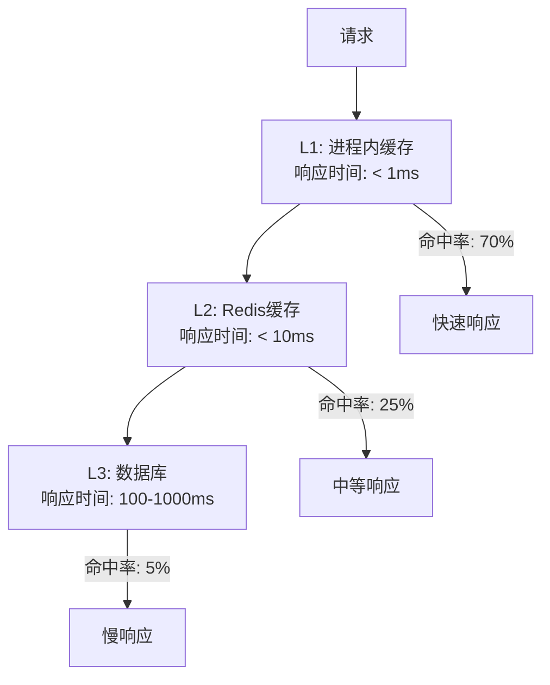

# SpringAI-MCP 优化路线图

## 项目现状评估

### 🎯 当前系统优势
- ✅ **架构设计合理**: 模块化设计，职责清晰
- ✅ **技术栈先进**: Java 24、虚拟线程、Spring Boot 3.4.1
- ✅ **安全性完善**: 多层 SQL 注入防护
- ✅ **用户体验良好**: Vue.js 3 现代化前端
- ✅ **智能学习**: 泛化学习系统支持模式优化
- ✅ **缓存已优化**: 本地缓存生效，减少数据库访问

### ⚠️ 主要性能瓶颈
1. **AI API 延迟**: 单次查询 13-14秒，主要耗时在 DeepSeek API 调用
2. **数据库结构发现**: 首次访问需要完整扫描 121 个表
3. **前端资源加载**: 依赖外部 CDN 资源
4. **缓存层级不足**: 仅有本地缓存，缺乏分布式支持

## 优化路线图

## 阶段一: 性能优化 (1-2 周) 🚀

### 1.1 AI API 性能优化
**优先级**: 🔥 极高

**问题分析**:
- 每次查询都需要发送完整的数据库结构到 AI
- AI 响应时间占总处理时间的 80-90%
- 没有 AI 响应缓存机制

**优化方案**:

#### 1. 实现 AI 响应缓存
```java
@Service
public class AiResponseCache {
    // 基于查询特征的智能缓存
    public String getCachedResponse(String queryFingerprint) {
        // 查询指纹 = hash(用户查询 + 数据库结构版本)
    }
}
```

**预期收益**: 相似查询响应时间从 13s 降至 < 1s

#### 2. 数据库结构压缩
```java
// 优化前: 发送完整表结构 (1766 字段)
// 优化后: 发送核心表结构摘要 (< 100 核心字段)
private String generateCompactSchema(DatabaseSchema schema) {
    return schema.getTables().stream()
        .filter(table -> table.isFrequentlyUsed())
        .map(this::generateTableSummary)
        .collect(Collectors.joining("\n"));
}
```

**预期收益**: AI 处理时间减少 30-40%

#### 3. 异步 AI 调用优化
```java
@Async("aiProcessingExecutor")
public CompletableFuture<String> convertToSqlAsync(String query) {
    // 实现真正的异步处理
}
```

### 1.2 数据库访问优化
**优先级**: 🔥 高

#### 1. 增量结构发现
```java
@Component
public class IncrementalSchemaDiscovery {
    // 基于 INFORMATION_SCHEMA 变更检测
    public void detectSchemaChanges() {
        String currentVersion = calculateSchemaVersion();
        if (!currentVersion.equals(cachedVersion)) {
            updateIncrementalChanges();
        }
    }
}
```

**预期收益**: 结构发现时间从 5-7s 降至 < 1s

#### 2. 读写分离支持
```java
@Configuration
public class MultiDataSourceConfig {
    @Bean("readOnlyDataSource")
    public DataSource readOnlyDataSource() {
        // 只读副本连接，用于结构发现
    }
    
    @Bean("writeDataSource") 
    public DataSource writeDataSource() {
        // 主库连接，用于写操作 (如果需要)
    }
}
```

### 1.3 前端性能优化
**优先级**: 🔥 中

#### 1. 资源本地化
```bash
# 下载并本地化外部资源
npm install vue@3 element-plus @element-plus/icons-vue
```

#### 2. 虚拟滚动
```vue
<template>
  <virtual-list
    :data-sources="queryResults.rows"
    :data-component="ResultRow"
    :keeps="50"
  />
</template>
```

**预期收益**: 页面加载时间减少 60%，大数据集渲染流畅

### 阶段一预期总收益 📊
- **查询响应时间**: 13s → 3-5s (60-70% 改善)
- **页面加载速度**: 提升 60%
- **用户体验**: 显著改善

## 阶段二: 扩展性优化 (2-4 周) 🏗️

### 2.1 分布式缓存集成
**优先级**: 🔥 高

#### 1. Redis 完整集成
```java
@Configuration
@EnableRedisRepositories
public class RedisIntegrationConfig {
    
    @Bean
    public RedisTemplate<String, DatabaseSchema> schemaRedisTemplate() {
        // 专用于数据库结构缓存
    }
    
    @Bean 
    public RedisTemplate<String, String> aiResponseRedisTemplate() {
        // 专用于AI响应缓存
    }
}
```

#### 2. 多级缓存策略


### 2.2 多数据库支持
**优先级**: 🔥 中

#### 1. 数据库适配器模式
```java
public interface DatabaseAdapter {
    DatabaseSchema discoverSchema(String database);
    String generateSqlDialect(String standardSql);
}

@Component
public class MySQLAdapter implements DatabaseAdapter { }

@Component  
public class PostgreSQLAdapter implements DatabaseAdapter { }
```

#### 2. SQL 方言转换
```java
@Service
public class SqlDialectTranslator {
    public String translateToDialect(String sql, DatabaseType dbType) {
        // MySQL: LIMIT 100
        // PostgreSQL: LIMIT 100
        // SQL Server: TOP 100
    }
}
```

### 2.3 API 限流和监控
**优先级**: 🔥 中

#### 1. 请求限流
```java
@RestController
@RateLimiter(permits = 10, per = "1m")
public class Text2SqlController {
    
    @PostMapping("/text-to-sql")
    @RateLimit(key = "#request.remoteAddr", limit = 5, window = "1m")
    public ResponseEntity<McpResponse> textToSql() {
        // 基于IP的限流
    }
}
```

#### 2. 指标监控
```java
@Component
public class MetricsCollector {
    
    @EventListener
    public void onQueryProcessed(QueryProcessedEvent event) {
        meterRegistry.counter("text2sql.queries.total")
                    .tag("status", event.getStatus())
                    .increment();
                    
        meterRegistry.timer("text2sql.processing.time")
                    .record(event.getProcessingTime(), TimeUnit.MILLISECONDS);
    }
}
```

## 阶段三: 企业级功能 (1-2 月) 🏢

### 3.1 权限和安全增强

#### 1. 用户认证系统
```java
@Configuration
@EnableWebSecurity
public class SecurityConfig {
    
    @Bean
    public SecurityFilterChain filterChain(HttpSecurity http) {
        return http
            .authorizeHttpRequests(auth -> auth
                .requestMatchers("/api/text2sql/**").authenticated()
                .requestMatchers("/api/admin/**").hasRole("ADMIN")
            )
            .oauth2Login(oauth2 -> oauth2
                .userInfoEndpoint(userInfo -> userInfo
                    .userService(customUserService())
                )
            )
            .build();
    }
}
```

#### 2. 查询审计日志
```java
@Entity
@Table(name = "query_audit_log")
public class QueryAuditLog {
    private String userId;
    private String naturalLanguageQuery;
    private String generatedSql;
    private String executionStatus;
    private LocalDateTime executedAt;
    private Long executionTimeMs;
    private String ipAddress;
}
```

### 3.2 高级 AI 功能

#### 1. 多轮对话支持
```java
@Service
public class ConversationalAI {
    
    public String processConversationalQuery(
        String currentQuery, 
        List<String> conversationHistory
    ) {
        // 维护对话上下文
        // 理解指代关系和增量需求
    }
}
```

#### 2. 自动查询优化建议
```java
@Component
public class QueryOptimizer {
    
    public QueryOptimizationSuggestion analyzeSql(String sql) {
        return QueryOptimizationSuggestion.builder()
            .originalSql(sql)
            .suggestions(Arrays.asList(
                "添加 WHERE 条件以减少结果集",
                "考虑在 user_id 字段上添加索引"
            ))
            .estimatedImprovement("查询时间可能减少 70%")
            .build();
    }
}
```

### 3.3 数据可视化集成

#### 1. 图表自动生成
```java
@Service
public class ChartRecommendationService {
    
    public ChartRecommendation recommendChart(QueryResult result) {
        // 基于数据类型和数量自动推荐图表类型
        // 柱状图、折线图、饼图等
    }
}
```

#### 2. 仪表板支持
```vue
<template>
  <dashboard>
    <chart-widget v-for="query in savedQueries" :key="query.id" />
    <real-time-metrics />
    <query-performance-stats />
  </dashboard>
</template>
```

## 阶段四: 平台化演进 (3-6 月) 🌐

### 4.1 微服务架构

#### 1. 服务拆分
```yaml
services:
  - name: text2sql-core
    responsibility: 核心转换逻辑
    
  - name: schema-discovery  
    responsibility: 数据库结构发现
    
  - name: ai-integration
    responsibility: AI模型集成
    
  - name: cache-service
    responsibility: 分布式缓存
    
  - name: user-management
    responsibility: 用户和权限管理
```

#### 2. 服务网格
```yaml
# istio-gateway.yaml
apiVersion: networking.istio.io/v1alpha3
kind: Gateway
metadata:
  name: text2sql-gateway
spec:
  servers:
  - port:
      number: 80
      name: http
      protocol: HTTP
    hosts:
    - text2sql.company.com
```

### 4.2 多租户支持

#### 1. 租户隔离
```java
@Entity
@Table(name = "tenant_config")
public class TenantConfig {
    private String tenantId;
    private String databaseConnectionString;
    private Map<String, Object> aiModelConfig;
    private SecuritySettings securitySettings;
}
```

#### 2. 资源配额管理
```java
@Component
public class TenantQuotaManager {
    
    public boolean checkQuota(String tenantId, QuotaType type) {
        // 检查查询次数、存储配额等限制
    }
}
```

## 性能目标对比

| 指标 | 当前状态 | 阶段一目标 | 阶段二目标 | 最终目标 |
|------|----------|------------|------------|----------|
| 查询响应时间 | 13-14s | 3-5s | 1-3s | < 1s |
| 缓存命中率 | ~30% | 70% | 85% | 95% |
| 并发支持 | 50 req/s | 200 req/s | 1000 req/s | 5000 req/s |
| 数据库支持 | MySQL | MySQL | MySQL+PG | 多数据库 |
| 部署复杂度 | 单体 | 单体优化 | 分布式 | 微服务 |

## 技术栈演进规划

### 当前技术栈
```yaml
backend:
  - Spring Boot 3.4.1
  - Java 24 (Virtual Threads)
  - MySQL + HikariCP
  - Local Cache

frontend:
  - Vue.js 3
  - Element Plus
  - 外部 CDN 依赖

ai_integration:
  - DeepSeek API
  - Spring AI 1.0.0-M5
```

### 目标技术栈
```yaml
backend:
  - Spring Boot 3.4.x (微服务)
  - Java 24+ (Virtual Threads + Loom)
  - MySQL + PostgreSQL + Redis
  - Distributed Cache (Redis Cluster)
  - Message Queue (RabbitMQ/Kafka)

frontend:
  - Vue.js 3 + Vite
  - Element Plus (本地化)
  - PWA 支持
  - WebSocket 实时通信

ai_integration:
  - 多AI模型支持 (DeepSeek/OpenAI/本地模型)
  - Model Router (智能路由)
  - Response Streaming
  
infrastructure:
  - Docker + Kubernetes
  - Istio Service Mesh
  - Prometheus + Grafana
  - ELK Stack (日志)
```

## 实施建议

### 优先级排序
1. **🔥 立即执行 (本周)**:
   - AI 响应缓存实现
   - 数据库结构压缩优化
   - 前端资源本地化

2. **🔥 短期目标 (2周内)**:
   - 增量结构发现
   - 虚拟滚动优化
   - 基础监控指标

3. **🔥 中期规划 (1月内)**:
   - Redis 分布式缓存
   - 多数据库支持基础框架
   - API 限流机制

4. **🔥 长期愿景 (3月内)**:
   - 微服务架构迁移
   - 企业级安全功能
   - 平台化运营

### 风险评估
- **技术风险**: 微服务拆分可能影响现有功能稳定性
- **性能风险**: 分布式架构可能引入网络延迟
- **运维风险**: 系统复杂度增加，运维成本上升

### 建议实施策略
1. **增量演进**: 避免大规模重构，采用增量改进
2. **向后兼容**: 保持 API 接口稳定性
3. **A/B 测试**: 新功能通过灰度发布验证
4. **监控先行**: 在优化前建立完善的监控体系

---

*最后更新: 2025-09-11*